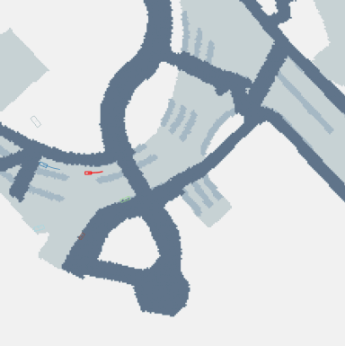

# CLD: Controllable Latent Diffusion for Traffic Simulation

CLD is an end-to-end framework for generating realistic and stable traffic scenarios for autonomous vehicle testing. It leverages a Variational Autoencoder (VAE) to compress high-dimensional driving trajectories into a compact latent space, where a diffusion model is trained to generate plausible scenarios. A reward-guided reinforcement learning mechanism is integrated to ensure that the generated trajectories meet user-specified controllability criteria.

**Dynamic and Realistic Vehicle Scenario Generation for Autonomous Safety Testing**

Codebase for **CLD**, focusing on the generation of controllable and dynamic hazardous driving scenarios for autonomous vehicle testing. This framework leverages reinforcement learning and diffusion models to create complex traffic situations, pushing the limits of safety-critical driving environments.

## Features

- **VAE-Based Latent Representation:** Compresses high-dimensional trajectories to reduce computational overhead.
- **Latent Diffusion Model:** Learns the distribution of real-world trajectories in a lower-dimensional space.
- **Reward-Guided Optimization:** Uses reinforcement learning to steer the generative process for enhanced controllability.
- **Comprehensive Evaluation:** Demonstrates improvements in realism and safety metrics compared to state-of-the-art baselines.

## Video Demonstrations
<!-- Start of Selection -->


<div style="display: grid; grid-template-columns: repeat(2, 1fr); gap: 5px;">
    <div>
        
    </div>
    <div>
        
    </div>
 
</div>

<!-- End of Selection -->


## Installation

### Basic Setup (mainly based on tbsim)

1. **Create Conda Environment**

   Note: Since nuplan-devkit requires Python ≥3.9, please create a virtual environment with Python 3.9 instead of 3.8.
   ```bash
   conda env create -f environment.yaml
   conda activate cld
2. **Clone the Repository and Install the Code**
    ```bash
    cd ~
    git clone https://github.com/RoboSafe-Lab/Controllable-Latent-Diffusion-for-Traffic-Simulation
    cd HazardForge
    pip install -e .
3. **Install trajdata**
    ```bash
    cd ..
    git clone https://github.com/AIasd/trajdata.git
    cd trajdata
    pip install -r trajdata_requirements.txt
    pip install -e .
4. **Install Pplan**
    ```bash
    cd ..
    git clone https://github.com/NVlabs/spline-planner.git Pplan
    cd Pplan
    pip install -e .
## Quick start
### 1. Obtain dataset(s)
We currently support the nuScenes [dataset](https://www.nuscenes.org/nuscenes).

#### nuScenes
* Download the nuScenes dataset (with the v1.3 map extension pack) and organize the dataset directory as follows:
    ```
    nuscenes/
    │   maps/
    │   v1.0-mini/
    │   v1.0-trainval/
    ```
### 2. Training Procedure
The training process is divided into three stages:
#### 1.VAE Training
Train the Variational Autoencoder to learn a compact latent representation of driving trajectories.
#### 2.Diffusion Model (DM) Training
With a pretrained VAE, train the diffusion model in the latent space to capture the distribution of real-world trajectories.
#### 3. PPO Training
Train the PPO-based module using reward-guided optimization to generate controllable trajectories based on user-specified criteria.

You can specify which stage to run by setting the train.mode parameter in the config.yaml file:
* vae: Train only the VAE
* dm:Train the Diffusion Model with a fixed, pretrained VAE. 
* ppo — Train the PPO module on top of the DM using reward-guided optimization.

Once you have updated config.yaml with your desired training mode, simply run:
    ```
    python train.py
    ```

